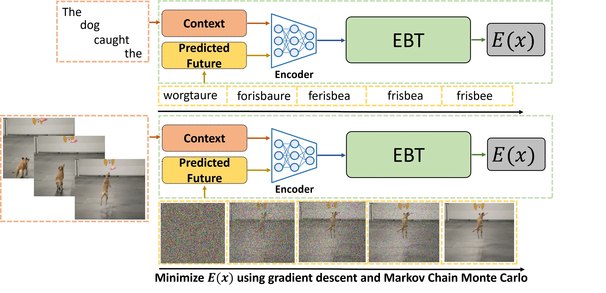
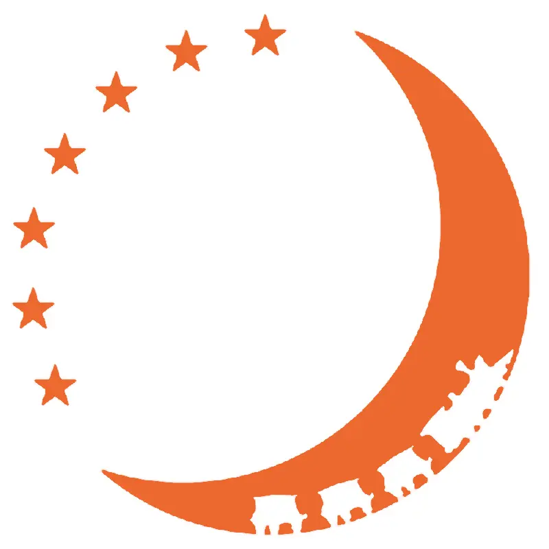
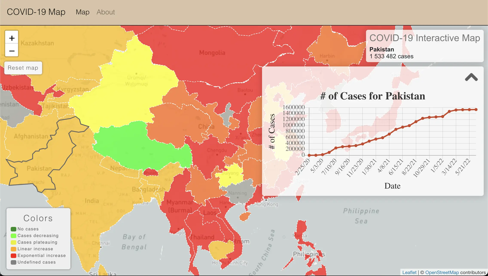
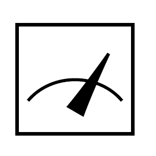
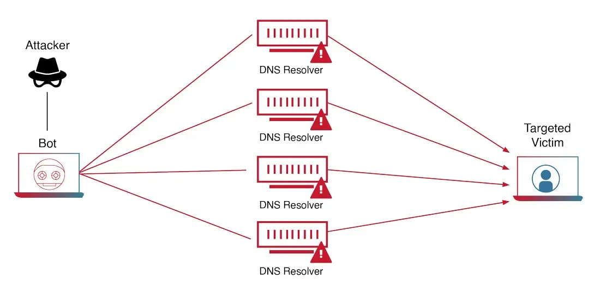
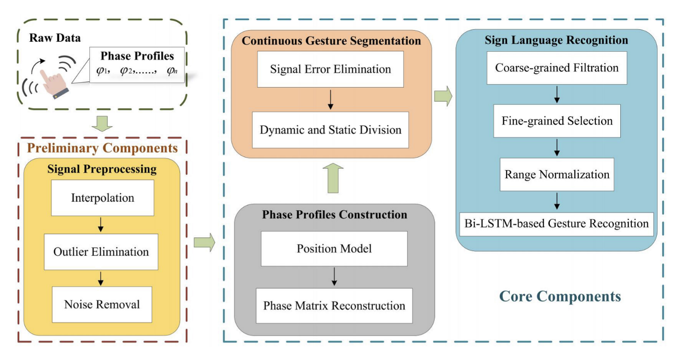
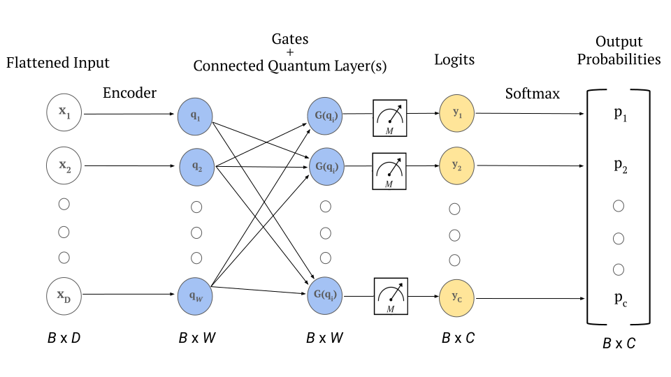



    

  

    <h2>RAD-Attack: Regularized Adversarial White-Box Attacks on VLMs</h2>
    

      

        
      

      

        
<strong>Authors:</strong> Ganesh Nanduru, Nate Kimball, Alex Fetea 

        
We trick Meta AI's LLaVa model into misclassifying digits with minimal perturbations!

        

          <a target="_blank" href="https://github.com/nanduruganesh/rad-attack/blob/main/report.pdf">Paper</a> | 
          <a target="_blank" href="https://github.com/nanduruganesh/rad-attack">Code</a>
        

      

    

  

 

  

    <h2>Cognitively Inspired Energy-Based World Models</h2>
    

      

        
      

      

        
<strong>Authors:</strong> Alexi Gladstone, Ganesh Nanduru, Md Mofijul Islam, Aman Chadha, Jundong Li, Tariq Iqbal 

        
We train an energy-based model inspired by System 2 thinking that scales better than traditional autoregressive transformers with respect to data and GPU hours in computer vision tasks.

        

          <a target="_blank" href="https://arxiv.org/abs/2406.08862">Paper</a>
          <!-- <a target="_blank" href="https://github.com/nanduruganesh/rad-attack">Code</a> -->
        

      

    

  

 

  

    <h2>UVA Night Train Website</h2>
    

      

        
      

      

        
<strong>Authors:</strong> Ganesh Nanduru 

        
 Created a website for my frisbee team to record our history, increase visibility, and help raise funds for our tournaments! 

        

          <a target="_blank" href="https://uvanighttrain.com/">Website</a>
        

      

    

  

 

  

    <h2>COVID-19 Tracker</h2>
    

      

        
      

      

        
<strong>Authors:</strong> 
          
          
        

        
An interactive COVID-19 casemap, color coded with AI-classified case trends. 

        

          <a target="_blank" href="https://covid19-map.com/">Website</a> |
          <a target="_blank" href="https://github.com/nanduruganesh/CoronaTrackerAPI">Code (Data Collection)</a>
        

      

    

  

 

  

    <h2>QNN Noise Robustness on MNIST</h2>
    

      

        
      

      

        
<strong>Authors:</strong> Ganesh Nanduru, Alexi Gladstone 

        
We implement three neural networks: one classical, one qubit-based, and one with hybrid architecture, to determine if the use of qubits can increase their noise robustness on the MNIST classification task. 

        

          <a target="_blank" href="../files/qnn_noise_robustness.pdf">Paper</a> 
          <a target="_blank" href="https://github.com/nanduruganesh/qmnist">Code</a>
        

      

    

  

 

  

    <h2>PCAP-LM</h2>
    

      

        
      

      

        
<strong>Authors:</strong> Ganesh Nanduru, Christopher Johnson 

        
We trained an LLM to read network traffic, to detect and explain potential DDoS attacks! 

        

          <a target="_blank" href="https://github.com/nanduruganesh/pcaplm/blob/master/Network_Security_Final_Project.pdf">Paper</a> |
          <a target="_blank" href="https://github.com/nanduruganesh/pcaplm">Code</a>
        

      

    

  

 

  

    <h2>Video Swin Transformer for Medical Image Regression</h2>
    

      

        
      

      

        
<strong>Authors:</strong> Ganesh Nanduru, Sravanth Potluri, Rahul Reddy, Swakshar Deb 

        
We trained a 3D Swin Transformer to map videos of heart palpitations to their time-of-systole heartbeat curves, then compared results with a traditional CNN.

        

          <a target="_blank" href="https://github.com/nanduruganesh/SwinTransformer/blob/main/MLIA___Final_Project-2.pdf">Paper</a> | 
          <a target="_blank" href="https://github.com/nanduruganesh/SwinTransformer">Code</a>
        

      

    

  

 

  

    <h2>Survey of Wireless Sensing Techniques for ASL Recognition</h2>
    

      

        
      

      

        
<strong>Authors:</strong> Ganesh Nanduru, Leena Bacha, Sarah Boyce 

        
We survey and compare state-of-the-art wireless sensing techniques for detecting American Sign Language (ASL).

        

          <a target="_blank" href="../files/asl_recognition_survey.pdf">Paper</a>
        

      

    

  

 

  

    <h2>Survey of Quantum Software Testing Methods</h2>
    

      

        
      

      

        
<strong>Authors:</strong> Ganesh Nanduru, Alex Walsh 

        
We analyze test suites designed to cover the unique code branches of quantum computing. 

        

          <a target="_blank" href="../files/quantum_testing_survey.pdf">Paper</a>
        

      

    

  

 
<!-- Style and script below are for the clickable "and x more" authors for covid map -->

